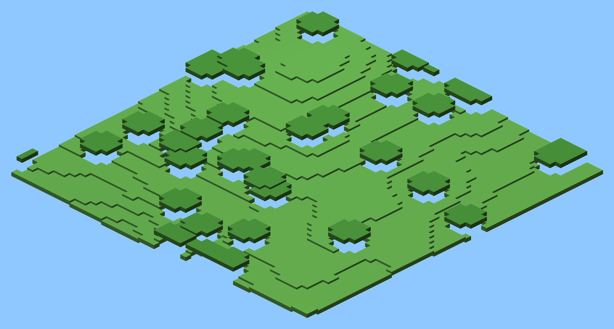
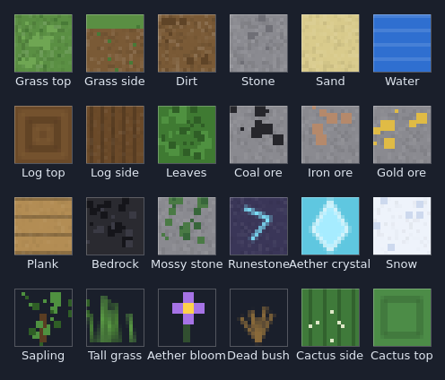
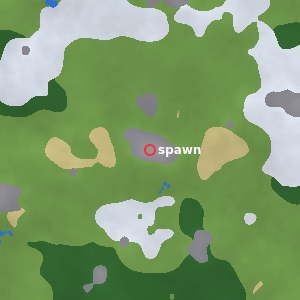

# Minescape

A multiplayer sandbox game that crosses **RuneScape's** skills and progression
with **Minecraft's** voxel world. Built for **1–8 players** who share one
persistent world running on a small authoritative server.

It runs entirely in the browser (TypeScript + [Three.js](https://threejs.org/))
with a Node.js WebSocket game server — so friends join by opening a single URL,
no install required.



*An isometric render of an actual generated world (run `npx tsx tools/render-preview.ts` to make your own).*



*Block textures are generated procedurally on a canvas at runtime — no image
assets. Preview them with `npm i canvas && npx tsx tools/render-atlas.ts`.*

## What's in this vertical slice

**The Minecraft backbone**
- Procedurally generated voxel world (seeded terrain, hills, lakes, trees, ore,
  plus mystical mossy stone, glowing runestone and deep Aether crystals).
- Streamed chunks rendered with face-culled meshing, procedurally generated
  textures (built on a canvas — still no image assets), scene lighting, and a
  twilight "mystical" palette. Crystals and runes are self-lit.
- First-person controller with gravity, jumping, and voxel collision.
- **Tool-gated, timed mining:** hold to break; harder blocks take longer and
  need the right tool (hatchet for wood, pickaxe for stone/ore, shovel for
  dirt/sand). Tiers — Bronze → Iron → Aether (crystal) — break faster.
- Place blocks; every edit is synced to all players in real time.

**Biomes**
- Five procedurally distributed biomes — **plains, forest, desert, snowy
  tundra, and mountains** — with their own surface blocks, tree cover, terrain
  height, and monsters. (Preview with `npm i canvas && npx tsx tools/render-biomes.ts`.)



**The RuneScape loop**
- 10 skills on the **authentic RuneScape XP curve** (1–99): Attack, Strength,
  Defence, Hitpoints, Woodcutting, Mining, Fishing, Smithing, Firemaking, Cooking.
- Gathering nodes: chop **trees**, mine **ore**, fish **water** — each with level
  and tool requirements; nodes deplete and respawn on a tick.
- **Combat:** roaming monsters per biome (goblins, wolves, scorpions, skeletons),
  click-to-attack tick combat, health, death/respawn, and loot drops. Train
  Attack/Strength/Hitpoints by fighting.
- **Equipment & armor:** equip weapons (Attack/Strength) and Bronze/Iron/Aether
  armor (Defence) into dedicated slots — worn gear, not just carried, drives
  combat and shows on your avatar. Buy bronze gear, smith iron, attune Aether.
- **Town with NPCs:** a banker (store items beyond your 28 slots), a shopkeeper
  (buy/sell with coins), and a quest giver.
- **Quests:** accept "The Goblin Menace", track kills, and claim a reward.
- **Smithing:** smelt ore into bars and forge swords; attune Aether gear with crystals.
- A 28-slot inventory, a large bank, and crafting (planks, cooking, tools, weapons).

**Multiplayer**
- Up to 8 players in one world, with live avatars, name tags, shared monsters, and chat.

**Persistence**
- Log in with a name + optional password; your character (skills, inventory,
  bank, HP, position, quest progress) and the world (seed + the blocks you've
  mined/placed) are saved and restored. Saved on disconnect, every 30s, and on
  shutdown. Storage backend is pluggable (`server/storage.ts`); the default
  writes `world-save.json`. Set `SAVE_PATH` to point it at a persistent disk.
  > **Hosting note:** Render's *free* web tier has an ephemeral filesystem, so
  > the save file is lost on redeploy/spin-down there. For durable cloud saves,
  > attach a Render persistent disk (and set `SAVE_PATH` to it) or wire a hosted
  > database into the Storage interface.

## Running it

```bash
npm install
npm run dev
```

Then open **http://localhost:5173**. `npm run dev` starts both the WebSocket
game server (port 8080) and the Vite client; Vite proxies `/ws` to the server,
so everything is behind one URL.

Set a fixed world with `SEED=12345 npm run dev`.

## Hosting it on a public URL (play from anywhere)

For production the Node server serves the built client **and** the game
WebSocket on a single origin, so one URL is all you need.

```bash
npm run build   # bundle the client into dist/
npm start       # serve client + game on http://localhost:8080
```

**Deploy from your phone (no computer needed):** this repo includes a
[`render.yaml`](./render.yaml) Blueprint. Go to [render.com](https://render.com),
choose **New + → Blueprint**, pick this repository/branch, and Render builds and
hands you a public `https` URL. The free plan supports WebSockets. A
[`Dockerfile`](./Dockerfile) is also included for Fly.io / Railway / any VPS.

> **Note on phones:** the controls use a keyboard (WASD) and mouse pointer-lock,
> so the game is currently **playable on a computer**, not a touchscreen. Hosting
> lets you open the world from a phone and share the link with friends on
> laptops/desktops. On-screen touch controls are a planned next step.

## Controls

| Action | Input |
| --- | --- |
| Look around | Click to lock mouse, then move |
| Move / jump | WASD / Space |
| Gather or mine a block | Left click |
| Place selected block | Right click |
| Select placeable item | Click it in your pack |
| Crafting menu | C |
| Chat | Enter |
| Help | H |

## Project layout

```
shared/    Types, blocks, items, skills (XP curve), gathering rules, protocol
server/    Authoritative game server: world gen, sessions, tick loop
client/    Three.js client: rendering, controls, networking, HUD
```

The `shared/` folder is the contract: both the server and client import the same
block ids, item definitions, skill maths, and message types, so the two halves
can never drift out of sync.

## Where to take it next

This is a foundation, not a finished game. Natural next steps: combat and
monsters (the Attack skill is already defined), a bank, NPCs and quests, world
persistence to disk, smithing/cooking chains, and an equipment system.
